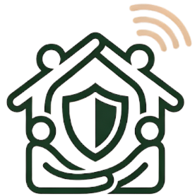

<p align="center">
  
</p>

<h1 align="center">DarBox</h1>

<p align="center">
  <strong>Plug-and-play parental control routers for Moroccan families</strong><br/>
  <a href="https://darbox.live">darbox.live</a>
</p>

<p align="center">
  <a href="https://darbox.live"></a>
  
  
  
  
  
</p>

---

## What is DarBox?

**DarBox** is a physical parental control service based in Tangier, Morocco. Standard consumer routers are purchased in bulk, professionally preconfigured with network-level protections, and resold to non-technical families as a turnkey internet safety solution—no apps to install, no subscriptions to manage.

Every router ships with:

| Layer | Configuration |
|-------|---------------|
| **DNS Filtering** | OpenDNS FamilyShield (`208.67.222.123` / `208.67.220.123`) — blocks adult content, malware, and phishing domains at the network level |
| **QoS** | Bandwidth prioritization rules that keep streaming and gaming fair across household devices |
| **Firewall** | Hardened rule set that drops unsolicited inbound traffic and restricts port exposure |
| **Admin lock** | Changed default credentials, disabled remote management, WPS off |

The business model relies entirely on the founder's networking expertise—no custom firmware, no software development, no heavy capital investment. Just deep knowledge of router internals applied at scale.

### Service Tiers

| Tier | Price (DH) | What the family gets |
|------|-----------|----------------------|
| **Essential** | 400 | Preconfigured router, DNS filtering, separate kids Wi-Fi network |
| **Curfew** | 480 | + Auto kids Wi-Fi shutdown (e.g. 10 PM), scheduled access windows |
| **Anti-Distraction** | 530 | + Block TikTok, Instagram, Roblox — useful internet, zero fluff |
| **Home Pack** | 750 | + Router + mesh repeater for large homes, full coverage |
| **Config-only** | 150–200 | Bring your own router — DarBox configures it |

---

## Live Demo

### → **[darbox.live](https://darbox.live)**

The production site is a trilingual (French / English / Arabic) marketing page with full RTL support for Arabic, scroll-triggered animations, an interactive offer drawer system, a downloadable PDF catalogue, and a newsletter signup flow.

---

## Tech Stack

| Concern | Choice | Why |
|---------|--------|-----|
| **Build tool** | [Vite 5](https://vitejs.dev/) | Sub-second HMR, native ESM, zero-config React support |
| **UI library** | [React 18](https://react.dev/) | Component model, hooks, concurrent features—industry standard |
| **Routing** | [React Router 7](https://reactrouter.com/) | `BrowserRouter` with `basename` support for GitHub Pages |
| **Styling** | [Tailwind CSS 4](https://tailwindcss.com/) + vanilla CSS | Tailwind for utility-first layout; custom CSS for animations, drawers, scroll-reveal, and print styles |
| **Icons** | [Lucide React](https://lucide.dev/) | Tree-shakeable SVG icon set |
| **Typography** | [Outfit](https://fonts.google.com/specimen/Outfit) (brand wordmark) + Apple system font stack | Premium feel without font-loading latency on body text |
| **Package manager** | [pnpm 9](https://pnpm.io/) | Fast, disk-efficient, strict dependency resolution |
| **Hosting** | [GitHub Pages](https://pages.github.com/) via custom domain | Free, CDN-backed, HTTPS by default |
| **CI/CD** | [GitHub Actions](https://github.com/features/actions) | Automated build and deploy on every `main` push |

---

## Architecture

```
darbox/
├── .github/workflows/
│   └── deploy.yml            # CI/CD — build + deploy to GitHub Pages
├── public/
│   ├── CNAME                 # Custom domain: darbox.live
│   └── assets/               # Static images (logo, favicons)
├── scripts/
│   └── generate-pdf.js       # Catalogue PDF generation utility
├── src/
│   ├── main.jsx              # App entry — BrowserRouter bootstrap
│   ├── App.jsx               # Shell: nav, footer, routing, lang modal
│   ├── index.css             # Design system + all animations
│   ├── translations.js       # FR / EN / AR translation strings
│   ├── catalogueTranslations.js
│   ├── newsletterTranslations.js
│   ├── drawerData.js         # Offer detail content (per-tier)
│   ├── components/
│   │   └── DarBoxLogo.jsx    # Reusable brand identity component
│   ├── hooks/
│   │   └── useScrollReveal.js # IntersectionObserver scroll animations
│   └── pages/
│       ├── Home.jsx           # Landing page with all conversion sections
│       ├── Catalogue.jsx      # Product catalogue with PDF download
│       └── Newsletter.jsx     # Subscription form + success state
├── index.html                # Vite entry HTML
├── vite.config.js            # Vite + Tailwind + React plugin config
├── package.json
└── pnpm-lock.yaml
```

### Key Architectural Decisions

**1. Trilingual with full RTL support**
The app detects language selection at first visit (modal gate) and propagates a `dir="rtl"` attribute for Arabic. All CSS animations—ticker scrolls, testimonial carousels, drawer panels—reverse direction in RTL mode. Translations are kept in standalone JS modules, not JSON, for easy interpolation of JSX content.

**2. No i18n framework**
Given three languages and a static marketing site, a full i18n library (i18next, FormatJS) would be over-engineered. A simple `T[lang].key` lookup keeps the bundle small and the code obvious.

**3. CSS-first animation system**
Two scroll-reveal systems coexist:
- `.reveal` / `.visible` — legacy Home page entrance animations
- `.sr` / `.sr-visible` — newer `IntersectionObserver`-driven system with stagger delays and scale-in variants

Both respect `prefers-reduced-motion` and degrade gracefully in print stylesheets.

**4. Offer drawer instead of detail pages**
Product tiers open in a slide-in drawer panel rather than navigating to a new page. This keeps the user in the conversion funnel and avoids full-page reloads. The drawer supports RTL with mirrored positioning and border styling.

**5. `base: '/'` in Vite config**
Since the site runs on a custom domain (`darbox.live`) rather than a GitHub Pages subpath (`username.github.io/repo`), assets are served from root. The `CNAME` file in `public/` ensures the custom domain persists across deploys.

---

## CI/CD Pipeline

Every push to `main` triggers an automated build-and-deploy workflow:

```
push to main
    │
    ▼
┌─────────────────────────┐
│  1. Checkout repository │
│  2. Setup pnpm v9       │
│  3. Setup Node.js 20    │
│  4. pnpm install        │
│  5. pnpm build (vite)   │
│  6. Upload ./dist       │
└────────────┬────────────┘
             │
             ▼
┌─────────────────────────┐
│  7. Deploy to           │
│     GitHub Pages        │
│     → darbox.live       │
└─────────────────────────┘
```

**Pipeline details:**
- **Concurrency control** — only one deployment runs at a time (`cancel-in-progress: false` prevents mid-deploy cancellations that could corrupt the Pages artifact)
- **Minimal permissions** — `contents: read`, `pages: write`, `id-token: write` (OIDC for Pages deployment)
- **pnpm caching** — `actions/setup-node` caches the pnpm store for faster installs

The full workflow is defined in [`.github/workflows/deploy.yml`](.github/workflows/deploy.yml).

---

## Local Development

```bash
# Prerequisites: Node.js ≥ 20, pnpm ≥ 9

# Clone and install
git clone https://github.com/marvlentt/darbox-live.git
cd darbox-live
pnpm install

# Start dev server (http://localhost:5173)
pnpm dev

# Production build
pnpm build

# Preview production build locally
pnpm preview
```

---

## What This Project Demonstrates

This isn't a SaaS platform or a complex distributed system. It's a **commercial product site** built to sell a physical service — and shipped to production. Here's what it shows:

| Competency | Evidence |
|-----------|----------|
| **Network engineering** | OpenDNS, QoS, firewall hardening, router configuration at scale — the actual product |
| **Frontend development** | React 18, Vite, Tailwind CSS 4, component architecture, custom hooks |
| **Internationalization** | Trilingual (FR/EN/AR), full RTL layout, bidirectional animations |
| **CI/CD** | GitHub Actions pipeline, GitHub Pages deployment, custom domain with HTTPS |
| **Accessibility** | `prefers-reduced-motion` support, print stylesheets, semantic HTML |
| **Design systems** | Consistent design tokens, reusable brand component, Apple-inspired aesthetics |
| **Shipping** | Live at [darbox.live](https://darbox.live) — not a tutorial, not a demo, a deployed product |

---

## License

This project and the DarBox brand are proprietary. All rights reserved.

---

<p align="center">
  <sub>Built in Tangier 🇲🇦 — where the Atlantic meets the Mediterranean.</sub>
</p>
